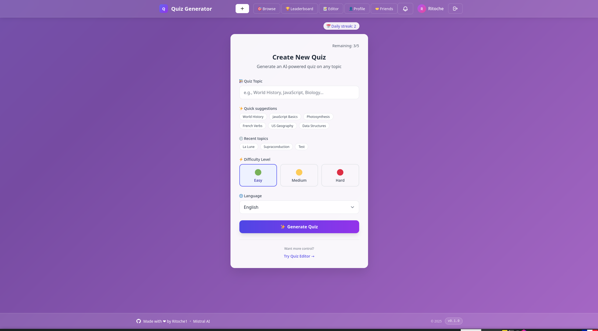
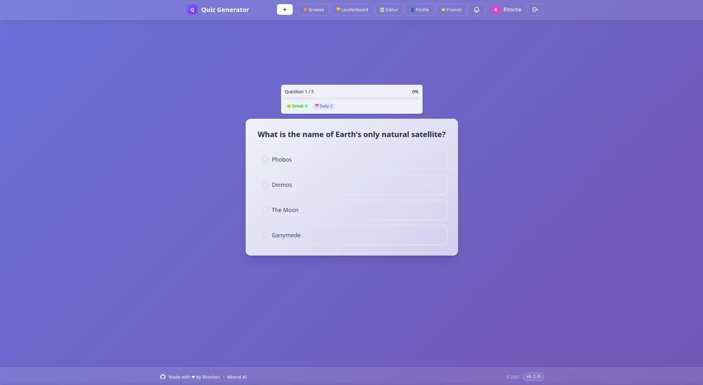
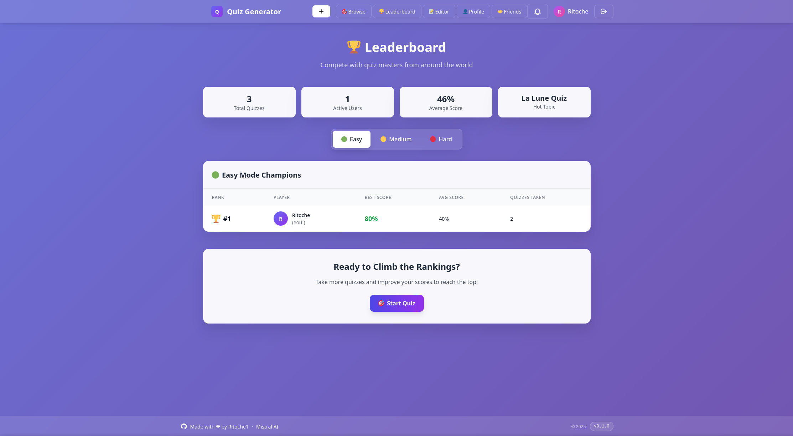

# 🧠 Quiz Generator

An AI-powered quiz platform — describe a topic, pick a difficulty and language, and get an instant multiple-choice quiz generated by Google's Gemini. Take quizzes, track your scores, and climb the leaderboard.

<p align="center">
  
</p>

## ✨ Features

- **AI quiz generation** — enter a topic, difficulty, and language; Gemini returns a structured 4-option multiple-choice quiz
- **Auth** — register/login with JWT + hashed passwords
- **Take quizzes & get scored** — attempts are saved with per-question answers
- **Quiz history** — see your past attempts and results
- **Leaderboard** — top scores by difficulty
- **Quiz editor** — create, edit, duplicate, and browse public quizzes, or start from a template
- **Profile** — avatar/cover uploads, account stats and streaks

<p align="center">
  
  
</p>

## 🏗️ Tech Stack

| | |
|---|---|
| **Frontend** | Next.js 15 (React 19), Tailwind CSS |
| **Backend** | Node.js, Express |
| **Database** | SQLite by default via Sequelize (swap in Postgres by setting `DATABASE_URL`) |
| **Auth** | JWT + bcrypt |
| **AI** | Google Gemini (`@google/genai`) |
| **File uploads** | Multer (avatars/cover images) |

## 📁 Project Structure

```
Quiz-generator/
├── backend/
│   ├── config/         # DB + Gemini client setup
│   ├── controllers/     # Route handlers
│   ├── middleware/       # Auth, upload, error handling
│   ├── models/           # Sequelize models: User, Quiz, Score
│   ├── routes/           # Express routers
│   ├── services/         # Gemini prompt logic, quiz persistence
│   ├── utils/
│   └── server.js
├── frontend/
│   └── src/
│       ├── app/          # Next.js pages (home, browse, editor, leaderboard, profile...)
│       ├── components/    # QuizGenerator, QuizQuestion, QuizRecap, AuthForm, etc.
│       └── lib/
└── assets/               # Screenshots
```

## 🚀 Getting Started

### Prerequisites

- Node.js 18+
- A [Gemini API key](https://aistudio.google.com/apikey)

### 1. Clone the repo

```bash
git clone https://github.com/HimanshuChauhan2027/Quiz-generator.git
cd Quiz-generator
```

### 2. Backend setup

```bash
cd backend
npm install
cp .env.example .env
```

Fill in `.env`:

```env
PORT=5000
CORS_ORIGINS=http://localhost:83
DATABASE_URL=            # leave empty to use local SQLite
JWT_SECRET=change_this_to_a_long_random_string
JWT_EXPIRES_IN=7d
GEMINI_API_KEY=your_gemini_api_key_here
```

Start the server:

```bash
npm start       # or: npm run dev  (auto-restart with nodemon)
```

The API runs on `http://localhost:5000`. On first run it automatically creates the SQLite database and tables — no manual migrations needed. To use Postgres instead, just set `DATABASE_URL`.

### 3. Frontend setup

In a new terminal:

```bash
cd frontend
npm install
cp .env.example .env
```

`.env`:

```env
NEXT_PUBLIC_BASE_URL=http://localhost:5000/api
```

Start the dev server:

```bash
npm run dev
```

The app runs on `http://localhost:83` (custom port set in `package.json`).

## 📡 API Overview

| Method | Route | Auth | Description |
|--------|-------|:----:|-------------|
| POST | `/api/auth/register` | – | Create an account |
| POST | `/api/auth/login` | – | Log in |
| GET | `/api/auth/me` | ✅ | Current user profile |
| PATCH | `/api/auth/me` | ✅ | Update username |
| POST | `/api/auth/change-password` | ✅ | Change password |
| POST | `/api/auth/me/avatar`, `/me/cover` | ✅ | Upload profile pictures |
| DELETE | `/api/auth/delete-account` | ✅ | Delete account and its data |
| POST | `/api/auth/forgot-password`, `/reset-password` | – | Password reset flow |
| POST | `/api/generate/quiz` | ✅ | Generate a quiz with Gemini |
| GET | `/api/quizzes/` | – | List all quizzes |
| POST | `/api/quizzes/` | ✅ | Create a quiz |
| GET | `/api/quizzes/:id` | – | Get one quiz |
| PUT | `/api/quizzes/:id` | ✅ | Update your own quiz |
| DELETE | `/api/quizzes/:id` | ✅ | Delete your own quiz |
| GET | `/api/quizzes/browse/public` | – | Browse public quizzes |
| GET | `/api/quizzes/leaderboard/:difficulty` | – | Top scores for a difficulty |
| GET | `/api/quizzes/stats/global` | – | Platform-wide stats |
| GET | `/api/editor/my-quizzes` | ✅ | Quizzes you created |
| GET | `/api/editor/templates` | – | Starter quiz templates |
| POST | `/api/editor/quiz/:id/duplicate` | ✅ | Duplicate a quiz |
| POST | `/api/scores/:quizId` | ✅ | Record a quiz attempt |
| PUT | `/api/scores/:scoreId` | ✅ | Finalize an attempt |
| GET | `/api/scores/user/history` | ✅ | Your quiz history |
| GET | `/api/scores/latest/:quizId` | ✅ | Your latest attempt on a quiz |
| GET | `/api/scores/attempt/:scoreId` | ✅ | A specific attempt |
| DELETE | `/api/scores/:scoreId` | ✅ | Delete an attempt |
| GET | `/api/users/stats` | ✅ | Your personal stats & streak |


## 🤝 Contributing

Contributions are welcome! Feel free to open an issue or submit a pull request.

## 👤 Author

**Himanshu Chauhan**
NIT Kurukshetra

